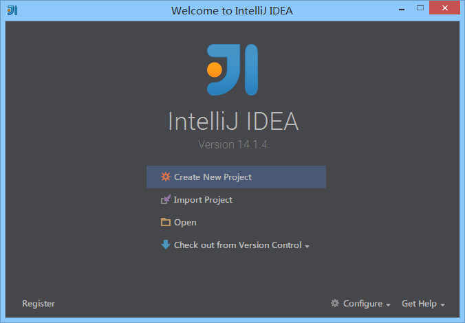
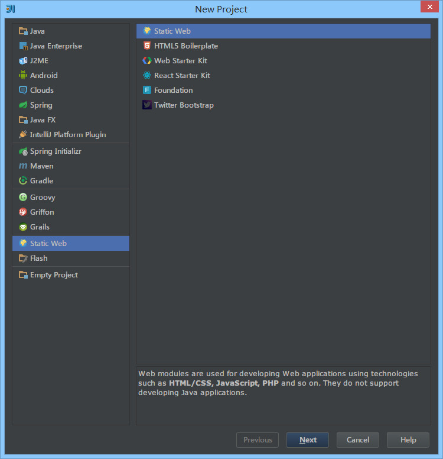
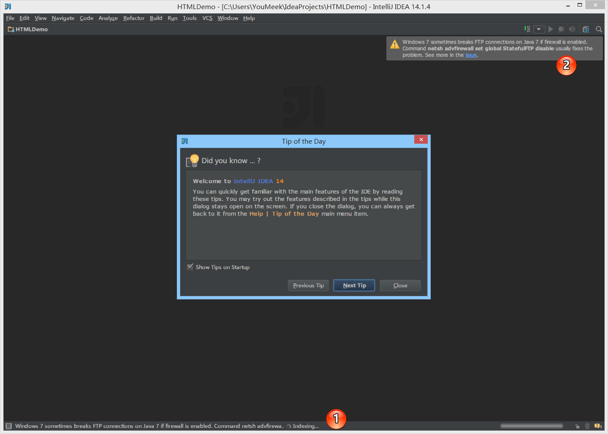

# IntelliJ IDEA 界面介绍

## 首次打开 

> * **重点说明：** IntelliJ IDEA 是没有类似 Eclipse 的工作空间的概念（`Workspaces` ），最大单元就是 `Project`。如果你同时观察多个项目的情况，IntelliJ IDEA 提供的解决方案是打开多个项目实例，你可以理解为开多个项目窗口。 
> * 命令 `Create New Project` 创建一个新项目。
> * 命令 `Import Project` 导入一个已有项目。
> * 命令 `Open` 打开一个已有项目，可以直接打开 Eclipse 项目，但是由于两者 IDE 下的项目配置不一样，所以项目还是需要配置的。
> * 命令 `Check out from Version Control` 可以通过服务器上的项目地址 Checkout Github 上面项目或是其他 Git 托管服务器上的项目。
> * 为了介绍 IntelliJ IDEA 界面，我们这里创建一个新 HTML 项目。

## 新建 HTML 项目

## 界面介绍

> * 对于首次创建或打开的新项目，IntelliJ IDEA 都会创建项目索引，如上图标注 1 所示。大型项目在创建索引过程中可能必须会卡顿，所以 **强烈建议** 创建索引过程最好不要动项目。
> * 每次进入项目中，IntelliJ IDEA 会根据当前项目情况进行问题反馈，或是升级更新提示等。使用方式如上图标注 2 所示。

> * 如上图，IntelliJ IDEA 默认界面是隐藏掉 `Toolbar` 和 `Tool Buttons`，我个人习惯看到这两个，所以一般都会进行开启。

> * 如上图标注 1 所示为开启 `Toolbar` 和 `Tool Buttons` 效果。
