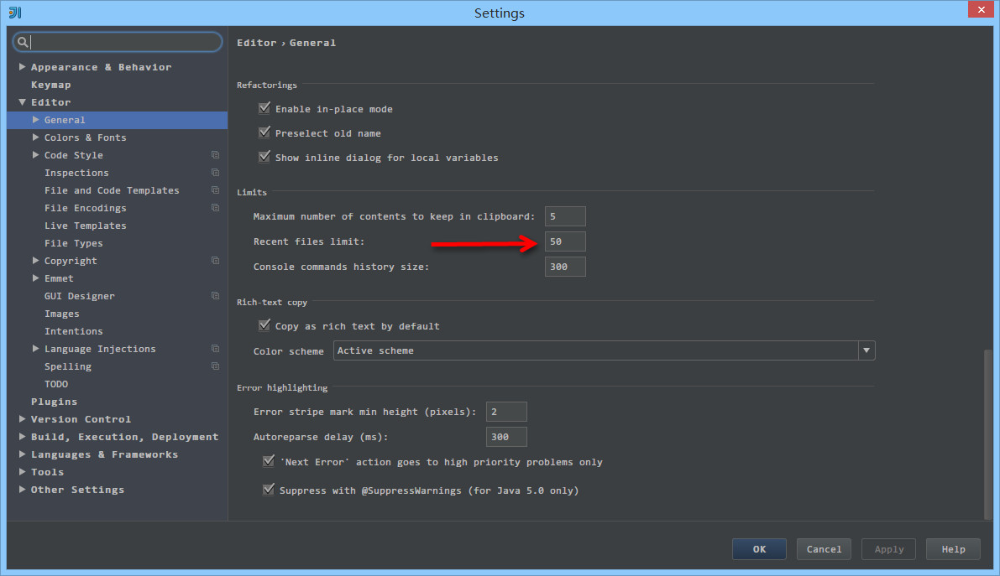
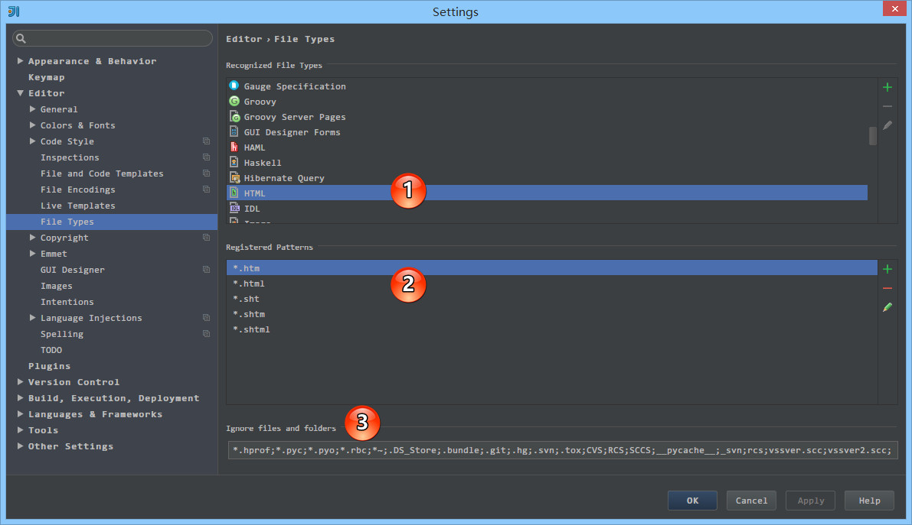

# IntelliJ IDEA 常用设置讲解 - 4

## 说明

IntelliJ IDEA 有很多人性化的设置我们必须单独拿出来讲解，也因为这些人性化的设置让我们这些 IntelliJ IDEA 死忠粉更加死心塌地使用它和分享它。

## 常用设置

- 如上图 Gif 所示，默认 Java 代码的头个花括号是不换行的，但是有人喜欢对称结构的花括号，可以进行此设置。对于此功能我倒是不排斥，我个人也是颇喜欢这种对称结构的，但是由于这种结构会占行，使得文件行数变多，所以虽然我个人喜欢，但是也不这样设置。

----------------------------------------------------------------------------

- 如上图箭头所示，该设置可以增加 `Ctrl + E` 弹出层显示的记录文件个数。

----------------------------------------------------------------------------

- 如上图标注 1 所示，该区域的后缀类型文件在 IntelliJ IDEA 中将以标注 2 的方式进行打开。
- 如上图标注 3 所示，我们可以在 IntelliJ IDEA 中忽略某些后缀的文件或是文件夹，比如我一般会把 `.idea` 这个文件夹忽略。

----------------------------------------------------------------------------

- 如上图 Gif 所示，这是一个 Maven 多模块项目，在开发多模块的时候，经常会改到其他模块的代码，而模块与模块之间是相互依赖，如果不进行 install 就没办法使用到最新的依赖。
- 所以，为了减少自己手动 install 的过程，可以把 install 过程放在项目启动之前，就像 Gif 所示那样。

----------------------------------------------------------------------------

- 如上图 gif 演示的：Load/Unload Modules 是 2017.2 引入的新特性，对于多模块的项目开发 Unload 部分少用到的模块可以减少计算机 CPU 和内存的消耗。

----------------------------------------------------------------------------

- 如上图所示 'Show in Run Dashboard'，在 2017.2.3 以后可以统一在一个 Tab 中管理所以模块应用。
- 这对于开发分布式系统（Spring Boot / Spring Cloud）来讲非常方便。

----------------------------------------------------------------------------

